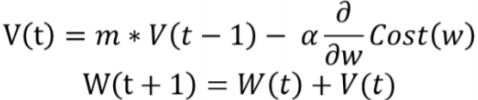
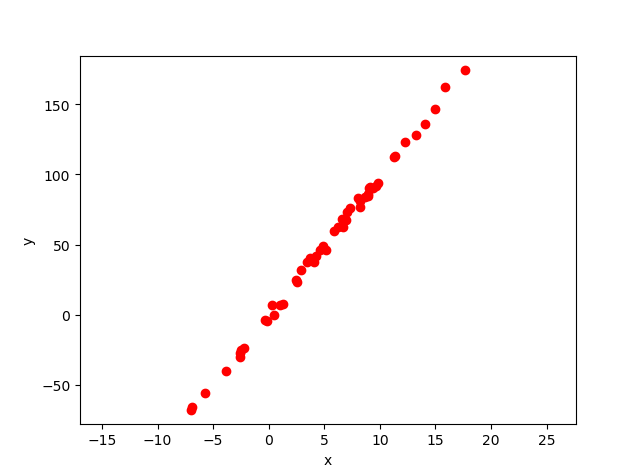
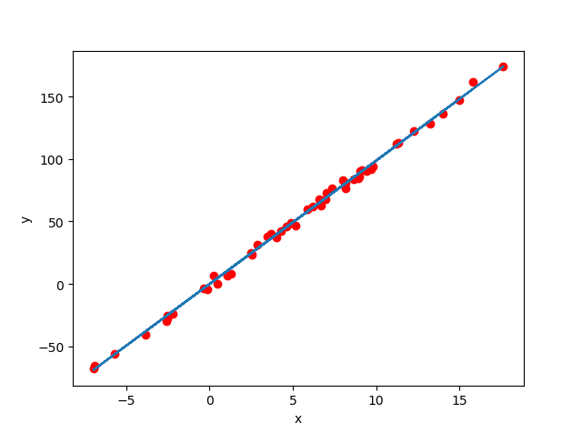
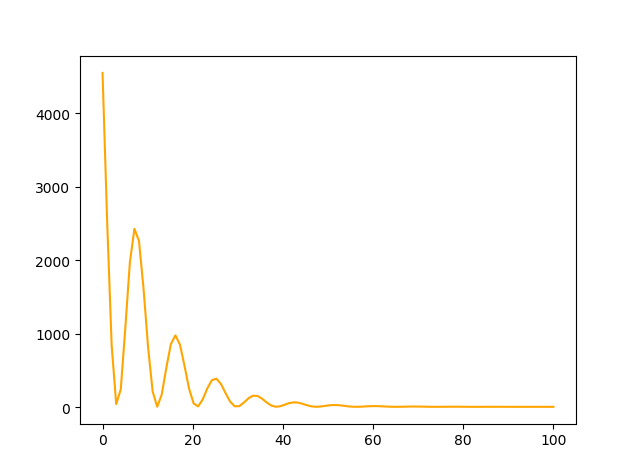
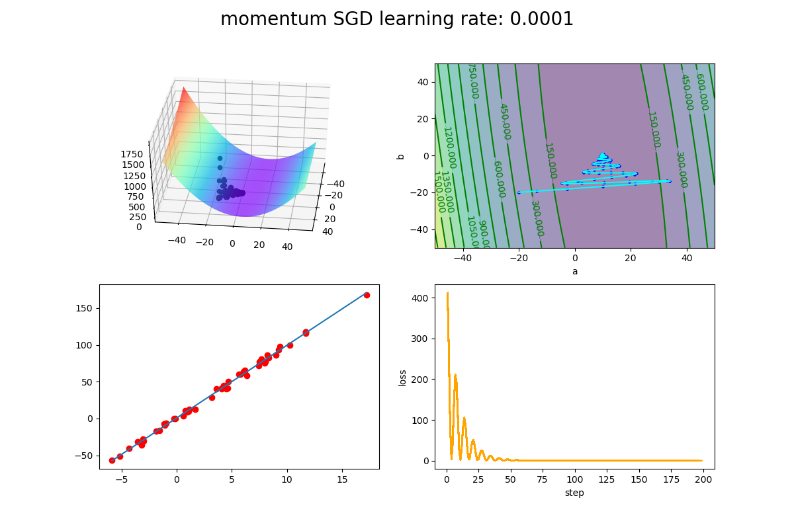

# Momentum-SGD

## 20191564 김신건

## 목차
1. 모멘텀 SGD의 개요 및 동작 원리

2. [모멘텀 SGD의 동작 코드 및 단위 테스트](##_2._모멘텀_SGD의_동작_코드와_단위_테스트)
    1. TensorFlow를 활용한 모멘텀 동작 코드(Linear regression)
    2. TensorFlow를 활용한 모멘텀 동작 코드 실행 결과
    3. TensorFlow를 활용한 모멘텀 동작 코드 단위 테스트
    4. 단위 테스트 결과
    
3. 모멘텀 SGD의 구체화
    1. numpy 를 활용한 SGD 구체화
    2. numpy 를 활용한 모멘텀 SGD 구체화
    3. numpy 를 활용한 Linear regression 모멘텀 SGD 코드
    4. 실행화면

4. 구체화한 모듈의 단위테스트
    1. 단위 테스트 코드 
    2. 단위테스트 결과

5. 로젠브룩 함수를 활용한 모멘텀 최적화 알고리즘 검증
    1. tensorflow를 활용한 모멘텀 SGD 실행 코드
    2. 5-1 실행 화면
    3. numpy를 활용한 모멘텀 SGD 실행 코드
    4. 5-3 실행 화면 
    5. 통계

6. 소감

## 1. 모멘텀 SGD의 개요 및 동작 원리

`모멘텀`은 물리에서 운동량, 관성, 탄성, 가속도 등을 의미하는 단어입니다. 따라서 모멘텀 SGD는 물리와 관련이 있음을 알 수 있으며, 경사하강법(SGD)에 관성을 더해 주는 알고리즘입니다.

경사하강법과 마찬가지로, 매번 기울기를 구한 뒤 바로 가중치에 반영하기 전에 이전에 수정한 방향을 참고하여, 일정 비율만 수정하게 됩니다. 이에 따라, 수정하는 방향이 왔다갔다하는 지그재그 현상이 줄어들고, 이전 이동값을 고려해 일정 비율을 반영한 다음값으로 이동하는 관성의 효과를 낼 수 있습니다.

`모멘텀 SGD`에서 갱신하려는 가중치 매개변수는 다음 수식과 같이 나타낼 수 있습니다. 



여기서, W는 갱신하려는 가중치 매개변수이며, V는 물리에서 말하는 속도를 의미합니다.

속도가 추가되는 것으로 하여금, 해를 찾아가는 과정에서 기울기 방향으로 물체가 가속되는 물리법칙을 모방하고 있습니다.

예를 들어 만약 가중치 매개변수가 2개 있는 최적해를 찾아가는 과정이라면, 어떤 곡면에서 공이 굴러가는 듯한 모습으로 최적해를 찾아가게 됩니다.

## 2. 모멘텀 SGD의 동작 코드와 단위 테스트

### 2-1. TensorFlow를 활용한 모멘텀 동작 코드(linear regression)

#### TensorFlow

**2차원 정규 분포 무작위 데이터 클래스**

> filename: src/twoDData.py 

2차원 평면에서 생성자의 매개변수로 주어지는
`점의 개수`, `생성하려는 정규분포 데이터 x값의 평균` ,`생성하려는 정규분포 데이터 x값의 분산`, `y값 가중치`, `y값의 노이즈`에 따라 2차원 데이터를 생성하고, 관리하는 클래스입니다.

```python
import numpy as np
import matplotlib.pyplot as plt

class twoDData:
    def __init__(self, num_points, x_mid, x_range, y_weight, noise_range):
        self.num_points = num_points
        self.x_mid = x_mid
        self.x_range = x_range
        self.y_weight = y_weight
        self.noise_range = noise_range
        self.x_data = []
        self.y_data = []

    def dataGeneration(self):
        data_set = []
        for i in np.arange(self.num_points):
            x = np.random.normal(self.x_mid, self.x_range)
            y = x * self.y_weight + np.random.randint(-self.noise_range, self.noise_range)
            data_set.append([x, y])

        x_data = [i[0] for i in data_set]
        y_data = [i[1] for i in data_set]

        self.x_data = x_data
        self.y_data = y_data
        
        return  x_data, y_data

    def dataDraw(self):
        plt.plot(self.x_data, self.y_data,'ro')
        plt.ylim([min(self.y_data)-10,max(self.y_data) +10])
        plt.xlim([min(self.x_data)-10,max(self.x_data) +10])
        plt.xlabel('x')
        plt.ylabel('y')
        plt.show()
```

**TensorFlow 핵심 Code**

momentum optimizer의 핵심 코드입니다.

```python
optimizer = tf.train.MomentumOptimizer(learning_rate=0.001, momentum=0.9)
```

**TensorFlow 전체 코드**

> filename: src/tensorflowLinearRegression.py

```python
import numpy as np
import matplotlib.pyplot as plt
import tensorflow as tf
from twoDData import twoDData

# linearRegression 코드
def dataLearning(x_data, y_data, learning_rate, momentum, step):
    # W = 기울기, b = y절편
    W = tf.Variable(tf.random_uniform([1], -1.0, 1.0))
    b = tf.Variable(tf.zeros([1]))
    y = W * x_data + b
    
    # 손실 함수 정의
    loss = tf.reduce_mean(tf.square(y - y_data))
    # optimize는 MomentumOptimizer를 사용한다.
    optimizer = tf.train.MomentumOptimizer(learning_rate = learning_rate, momentum = momentum)

    train = optimizer.minimize(loss)
    
    init = tf.initialize_all_variables()
    sess = tf.Session()
    sess.run(init)

    train_set = [] 

    for step in np.arange(step):
        sess.run(train)
        train_set.append([sess.run(W), sess.run(b), sess.run(loss)])

    plt.plot(x_data, y_data, 'ro')
    plt.plot(x_data, sess.run(W) * x_data + sess.run(b))
    plt.xlabel('x')
    plt.ylabel('y')
    plt.show()

    W_data = [t[0] for t in train_set]
    v_data = [t[1] for t in train_set]
    loss_data= [t[2] for t in train_set]

    return W_data,v_data, loss_data


if __name__ == '__main__':
    num_points=50
    data = twoDData(num_points, 5, 5, 10, 5,100)
    x_data, y_data=data.dataGeneration()
    data.dataDraw()

    W_data, v_data, loss_data = dataLearning(x_data, y_data, 0.001, 0.9, 100)

    plt.figure(2)
    plt.plot(np.linspace(0,100,100),loss_data,color='orange')
    print(loss_data[-1])
    plt.show()
```

## 2-2. TensorFlow를 활용한 모멘텀 동작 코드 실행 결과

### 생성 데이터

 

### 최종 결과

 

### 오차 그래프

 

## 2-3. TensorFlow를 활용한 모멘텀 동작 코드 단위 테스트

```python
import numpy as np
import matplotlib.pyplot as plt
import tensorflow as tf
from twoDData import twoDData
from tensorflowLinearRegression import dataLearning

class tensorflowLinearRegressionTest(tf.test.TestCase):
    def testLearning1(self):
        num_points=50
        learning_step = 500
        learning_rate = 0.01
        data = twoDData(num_points, 5, 5, 10, 5)
        x_data, y_data=data.dataGeneration()
        expected_W = (num_points * np.sum(x_data * y_data) - (np.sum(x_data) * np.sum(y_data))) / (num_points* np.sum(x_data**2) - (np.sum(x_data))**2)
        expected_v = (np.sum(y_data) - expected_W*np.sum(x_data))/num_points
        W_data, v_data, loss_data = dataLearning(x_data, y_data, learning_rate, 0.9, learning_step)
        self.assertAlmostEqual(expected_W, W_data[-1], delta = 0.001)
        self.assertAlmostEqual(expected_v, v_data[-1], delta = 0.001)

    def testLearning2(self):
        num_points=100
        learning_step = 1000
        learning_rate = 0.001
        data = twoDData(num_points, 10, 10, 10, 5)
        x_data, y_data=data.dataGeneration()
        expected_W = (num_points * np.sum(x_data * y_data) - (np.sum(x_data) * np.sum(y_data))) / (num_points* np.sum(x_data**2) - (np.sum(x_data))**2)
        expected_v = (np.sum(y_data) - expected_W*np.sum(x_data))/num_points
        W_data, v_data, loss_data = dataLearning(x_data, y_data, learning_rate, 0.9, learning_step)
        self.assertAlmostEqual(expected_W, W_data[-1], delta = 0.001)
        self.assertAlmostEqual(expected_v, v_data[-1], delta = 0.001)


if __name__ == "__main__":
    tf.test.main()
```

## 2-4. 단위 테스트 결과

Linear Regression의 결과와 편미분을 통해 알 수 있는 선형 회귀의 수치와 비교하였고, 
0.001보다 작은 오차를 가지고 수치가 도출되었는지 테스트하였고 모두 성공하였습니다.
```
Running tests under Python 3.7.3: C:\Users\kimshinkeon\Anaconda3\python.exe
[ RUN      ] tensorflowLinearRegressionTest.testLearning1
[       OK ] tensorflowLinearRegressionTest.testLearning1
[ RUN      ] tensorflowLinearRegressionTest.testLearning2
[       OK ] tensorflowLinearRegressionTest.testLearning2
[ RUN      ] tensorflowLinearRegressionTest.test_session
[  SKIPPED ] tensorflowLinearRegressionTest.test_session
----------------------------------------------------------------------
Ran 3 tests in 23.923s

OK (skipped=1)
```

## 3. 모멘텀 SGD의 구체화

### 3-1. numpy 를 활용한 SGD 구체화
```python
class SGD:

    def __init__(self, lr=0.01):
        self.lr = lr
        
    def update(self, params, grads):
        for key in params.keys():
            params[key] -= self.lr * grads[key]
```

### 3-2. numpy 를 활용한 모멘텀 SGD 구체화

```python
from SGD import SGD

class Momentum(SGD):
    def __init__(self, lr = 0.01, momentum = 0.9):
        self.lr = lr
        self.momentum = momentum
        self.v = None

    def update(self, params, grads):
        if self.v is None:
            self.v = {}
            for key, val in params.items():
                self.v[key] = np.zeros_like(val)
          
        for key in params.keys():
            self.v[key] = self.momentum * self.v[key] -  self.lr * grads[key]
            params[key] +=  self.v[key]
```

### 3-3. numpy 를 활용한 Linear regression 모멘텀 SGD 코드

```python
momentumOptimizer = Momentum(lr= rate, momentum=momentum)
optimizerParams = {"a": a, "b":b}
optimizerGrads = {"a":0 ,"b": 0}
```
와 같이 3-2에서 만든 Momentum 클래스의 객체를 사용하여 Linear regression 코드를 작성하였고 데이터 시각화를 위해 
4개의 그래프를 출력하였습니다.

4개의 그래프는, 1) MSE를 3차원으로 표현한 그래프, 2) 1번 그래프의 등고선, 3) 현재까지 찾은 최적해의 선형 함수와 데이터들의 분포 4) 현재 step까지의 전체 MSE 오차를 선그래프로 나타낸것 입니다. 실행 화면은 3-4에서 확인할 수 있습니다.

또한, dataLearning 함수를 만들어놓아서 Linear Regression 과정을 다른 파일에서도 사용할 수 있도록(모듈화) 하였습니다.

```python
import numpy as np
import matplotlib.pyplot as plt
from twoDData import twoDData
from mpl_toolkits.mplot3d import Axes3D
from Momentum import Momentum

def da(y,y_p,x):
    return np.sum((y-y_p)*(-x))

def db(y,y_p):
    return np.sum((y-y_p)*(-1))

# MSE를 반환하는 함수
def linear_loss(a, b, x, y):
    SSE = np.sum((y - (a * x + b))**2) / (2 * len(x))
    return SSE / len(x)

# 기울기, y절편, MSE를 3차원 평면으로 표시하는 함수
def show_surface(x,y):
    a = np.linspace(-50,50,500)
    b = np.linspace(-50,50,500)
    x = np.array(x)
    y = np.array(y)

    allMSE = np.zeros(shape=(len(a),len(b)))
    for i in range(0,len(a)):
        for j in range(0,len(b)):
            a0 = a[i]
            b0 = b[j]
            MSE = linear_loss(a=a0,b=b0,x=x,y=y)
            allMSE[i][j] = MSE

    a,b = np.meshgrid(a, b)

    return [a,b,allMSE]

def dataLearning(x_data, y_data, learning_rate, momentum, step, a, b):
    num_points = len(x_data)
    
    # 그래프 출력에 사용할 x 최소값, 최대값
    min_x = min(x_data)
    max_x = max(x_data)

    # momentum optimizer
    momentumOptimizer = Momentum(lr= learning_rate, momentum=momentum)
    optimizerParams = {"a": a, "b":b}
    optimizerGrads = {"a":0 ,"b": 0}

    all_loss = []
    all_step = []
    last_a = a
    last_b = b

    for step in range(1,step+1):
        loss = 0
        all_da = 0
        all_db = 0
        
        y_star = optimizerParams["a"] * x_data + optimizerParams["b"]
        loss = linear_loss(optimizerParams["a"],optimizerParams["b"],x_data,y_data)

        optimizerGrads["a"] = da(y_data, y_star, x_data)
        optimizerGrads["b"] = db(y_data, y_star)
            
        all_loss.append(loss)
        all_step.append(step)

        last_a = optimizerParams["a"]
        last_b = optimizerParams["b"]

        momentumOptimizer.update(params=optimizerParams, grads=optimizerGrads)

    return [last_a, last_b]


if __name__ == "__main__":
    
    # learning rate
    rate = 0.0001

    # 관성
    momentum = 0.9

    # 시작점
    a = -20.0
    b = -20.0

    # 점의 개수
    num_points=50
    # 데이터 생성
    data = twoDData(num_points, 5, 5, 10, 5)
    x, y=data.dataGeneration()

    # 그래프 출력에 사용할 x 최소값, 최대값
    min_x = min(x)
    max_x = max(x)

    # momentum optimizer
    momentumOptimizer = Momentum(lr= rate, momentum=momentum)
    optimizerParams = {"a": a, "b":b}
    optimizerGrads = {"a":0 ,"b": 0}


    # ----- 1,1 subplot 부분 ------

    # 평면 출력
    [aa,bb,MSE] = show_surface(x,y)
    # 전치 행렬로 바꾸기
    SSE = MSE.T

    fig = plt.figure(1, figsize=(12, 8))
    fig.suptitle('momentum SGD learning rate: %.4f' %(rate), fontsize=20)

    ax = fig.add_subplot(2, 2, 1, projection='3d')
    ax.plot_surface(aa, bb, MSE, rstride=2, cstride=2, cmap='rainbow')

    # ----- 1,1 subplot 부분 end -----

    plt.subplot(2,2,2)
    ta = np.linspace(-50, 50, 500)
    tb = np.linspace(-50, 50, 500)
    plt.contourf(aa,bb,SSE,15,alpha=0.5)
    C = plt.contour(aa,bb,SSE,15,colors="green")
    plt.clabel(C,inline=True)
    plt.xlabel('a')
    plt.ylabel('b')


    plt.ion()

    all_loss = []
    all_step = []
    last_a = a
    last_b = b

    for step in range(1,200):
        loss = 0
        all_da = 0
        all_db = 0
        
        y_star = optimizerParams["a"] * x + optimizerParams["b"]
        loss = linear_loss(optimizerParams["a"],optimizerParams["b"],x,y)

        optimizerGrads["a"] = da(y, y_star, x)
        optimizerGrads["b"] = db(y, y_star)

        ax.scatter(optimizerParams["a"], optimizerParams["b"], loss, color='black')
        plt.subplot(2,2,2)
        plt.scatter(optimizerParams["a"], optimizerParams["b"],s=5,color='blue')
        plt.plot([last_a,optimizerParams["a"]],[last_b,optimizerParams["b"]],color='aqua')

        plt.subplot(2, 2, 3)
        plt.cla()
        plt.plot(x, y, 'ro')
        virtual_x = np.linspace(min_x,max_x,2)
        virtual_y = optimizerParams["a"] * virtual_x + optimizerParams["b"]
        plt.plot(virtual_x, virtual_y)
            
        all_loss.append(loss)
        all_step.append(step)
        plt.subplot(2,2,4)
        plt.plot(all_step,all_loss,color='orange')
        plt.xlabel("step")
        plt.ylabel("loss")

        last_a = optimizerParams["a"]
        last_b = optimizerParams["b"]

        momentumOptimizer.update(params=optimizerParams, grads=optimizerGrads)

        print("step: ", step, " loss: ", loss)
        plt.show()
        plt.pause(0.01)
        
    plt.show()
    plt.pause(99)
```
### 3-4. 실행 화면

 

## 4. 구체화한 모듈의 단위테스트

### 4-1. 단위 테스트 코드  
```python
import unittest
import Momentum
import Rosenbrock
import numpy as np
from MomentumLinearRegression import  dataLearning
from twoDData import twoDData
from Momentum import Momentum

class TestMomentum(unittest.TestCase):

    def testMomentuminit(self):
        m = Momentum(1,1)
        self.assertEqual(1, m.momentum)
        self.assertEqual(1, m.lr)

        m2 = Momentum()
        self.assertEqual(0.01, m2.lr)
        self.assertEqual(0.9, m2.momentum)

    def testMomentumLinearRegression(self):
        # learning rate
        rate = 0.0001
        # 관성
        momentum = 0.9
        # 시작점
        a = -20.0
        b = -20.0
        # 점의 개수
        num_points=50
        # 데이터 생성
        data = twoDData(num_points, 5, 5, 10, 5)
        x_data, y_data=data.dataGeneration()

        last_W, last_v = dataLearning(x_data, y_data, rate,momentum,1000,a,b)

        expected_W = (num_points * np.sum(x_data * y_data) - (np.sum(x_data) * np.sum(y_data))) / (num_points* np.sum(x_data**2) - (np.sum(x_data))**2)
        expected_v = (np.sum(y_data) - expected_W*np.sum(x_data))/num_points

        self.assertAlmostEqual(expected_W, last_W, delta = 0.001)
        self.assertAlmostEqual(expected_v, last_v, delta = 0.001)

    def testMomentumLinearRegression2(self):
        # learning rate
        rate = 0.0001
        # 관성
        momentum = 0.9
        # 시작점
        a = 0.0
        b = 0.0
        # 점의 개수
        num_points=100
        # 데이터 생성
        data = twoDData(num_points, 10, 5, 10, 5)
        x_data, y_data=data.dataGeneration()

        last_W, last_v = dataLearning(x_data, y_data, rate,momentum,1000,a,b)

        expected_W = (num_points * np.sum(x_data * y_data) - (np.sum(x_data) * np.sum(y_data))) / (num_points* np.sum(x_data**2) - (np.sum(x_data))**2)
        expected_v = (np.sum(y_data) - expected_W*np.sum(x_data))/num_points

        self.assertAlmostEqual(expected_W, last_W, delta = 0.001)
        self.assertAlmostEqual(expected_v, last_v, delta = 0.001)
if __name__ == '__main__':
    unittest.main()
```

### 4-2. 단위 테스트 코드 결과

Linear Regression의 결과와 편미분을 통해 알 수 있는 선형 회귀의 수치와 비교하였고, 
0.001보다 작은 오차를 가지고 수치가 도출되었는지 테스트하였고 모두 성공하였습니다.

```
----------------------------------------------------------------------
Ran 3 tests in 0.055s

OK
```

## 5. 로젠브룩 함수를 활용한 모멘텀 최적화 알고리즘 검증

### 5-1. tensorflow를 활용한 모멘텀 SGD 실행 코드

```python


```

### 5-2. 5-1 실행 화면


### 5-3. numpy를 활용한 모멘텀 SGD 실행 코드

### 5-4. 5-3 실행 화면 

### 5-5. 통계

## 6. 소감